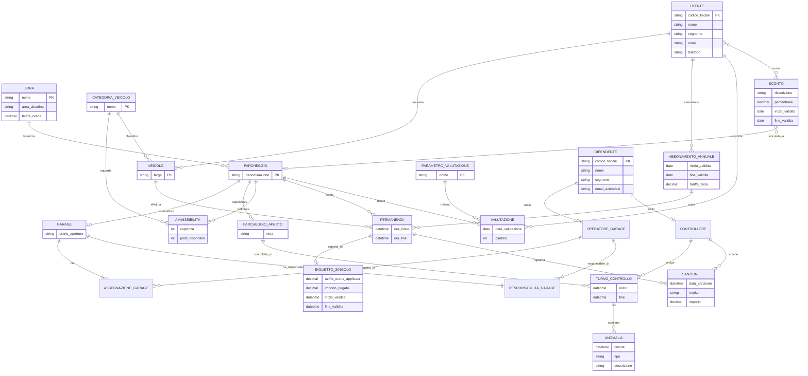
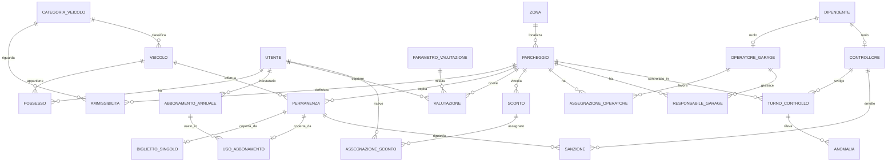

# Relazione di progetto - Blinkin' Park

Progetto per il Laboratorio di Basi di Dati 2025/2026.

La relazione e' consegnata come unico file Markdown. I diagrammi E-R sono rappresentati con Mermaid e l'implementazione SQL e' riportata in blocchi `sql` nello stesso file.

## 1. Progettazione concettuale

### 1.1. Requisiti iniziali

Si vuole progettare e costruire la base di dati della Blinkin' Park, azienda di gestione di parcheggi torinese. La base di dati conterra' informazioni sui parcheggi, sui veicoli, sugli utenti e sul personale.

L'azienda gestisce spazi per il parcheggio sia all'aperto, per zone, sia al chiuso, dentro i propri garage. I garage sono caratterizzati da un orario di apertura.

Chi vuole usufruire dei servizi di Blinkin' Park puo' usare due modalita': biglietto singolo o abbonamento annuale. Il costo del biglietto singolo e' orario e la tariffa dipende dalla zona della citta' in cui si trova il parcheggio. Di ogni zona si conoscono, oltre al costo, il nome e l'area della citta' che ne fa parte. L'abbonamento ha tariffa fissa.

Quando un utente inizia una permanenza in un parcheggio, vengono registrate la targa della macchina, l'ora di inizio e l'ora di fine. Gli abbonamenti sono nominali, cioe' legati ad una singola persona, di cui si registra nome, cognome, codice fiscale, numero di telefono opzionale e indirizzo email. Ogni abbonamento permette dunque all'utente registrato di posteggiare qualunque tra i veicoli in suo possesso, purche' non contemporaneamente. I clienti possono inoltre valutare i parcheggi utilizzati esprimendo un giudizio su diversi parametri, ad esempio pulizia e sicurezza.

Alcuni parcheggi, sia all'aperto sia garage, possono ospitare ogni tipo di veicolo, cioe' moto, automobili e camion, mentre altri sono idonei solo per moto e automobili. Di ogni parcheggio si conosce il numero di veicoli che puo' ospitare, eventualmente suddiviso per categoria, ed e' di interesse poter monitorare il numero di posti disponibili in tempo reale.

Ad ogni garage e' assegnato almeno un operatore, dipendente della Blinkin' Park, e uno di essi ne e' il responsabile e gestisce il personale assegnato al garage. I parcheggi all'aperto sono monitorati a rotazione da controllori, anch'essi dipendenti dell'azienda, che usano il sistema per verificare la correttezza delle soste, individuano eventuali anomalie, come sovra-occupazione, veicoli non ammessi o guasti, e possono elevare sanzioni in caso di sosta non consentita, ad esempio biglietto scaduto o veicolo non consentito. Dei controllori e' di interesse monitorare i turni di lavoro.

Per implementare politiche di fidelizzazione dei clienti, Blinkin' Park deve tenere traccia non solo degli abbonamenti e biglietti in corso di validita', ma anche di quelli scaduti. Infatti, l'azienda eroga periodicamente degli sconti agli automobilisti che ricorrono piu' frequentemente al servizio e, in alcuni casi, anche ai nuovi utenti. Gli sconti possono essere generici oppure legati ad aree parcheggio specifiche.

Gli utenti della base di dati sono vari. Gli addetti amministrativi si occupano di inserire gli abbonamenti, circa 50 al mese, e delle tariffe per zona, una volta ogni anno. Gli operatori di garage registrano gli ingressi e le uscite dei veicoli, circa 1000 al giorno. Contestualmente ad ogni ingresso e uscita viene aggiornato il conteggio visualizzato della disponibilita' dei posti per categoria di veicolo. La direzione ricorre al sistema per estrarre statistiche sull'occupazione dei parcheggi una volta al mese e, trimestralmente, i ricavi per zona e per garage. Infine, i clienti possono interagire con la base dati tramite app o sito web per consultare la disponibilita' dei posti, circa 100 accessi al giorno, o gestire i propri abbonamenti, circa 20 operazioni al mese.

### 1.2. Glossario dei termini

| Termine | Significato | Sinonimi eliminati o note |
| --- | --- | --- |
| Parcheggio | Spazio gestito da Blinkin' Park in cui un veicolo puo' sostare. | Comprende garage e parcheggi all'aperto. |
| Garage | Parcheggio al chiuso con orario di apertura. | Sotto-tipo di parcheggio. |
| Parcheggio all'aperto | Parcheggio non al chiuso, controllato a rotazione dai controllori. | Sotto-tipo di parcheggio. |
| Zona | Area tariffaria della citta'. | Determina la tariffa oraria del biglietto. |
| Veicolo | Mezzo che puo' sostare in un parcheggio. | Nei requisiti compare anche come macchina. |
| Categoria veicolo | Tipo di veicolo. | Moto, automobile, camion. |
| Utente | Persona che usa i servizi Blinkin' Park. | Cliente e automobilista sono usati con lo stesso significato. |
| Permanenza | Intervallo di sosta di un veicolo in un parcheggio. | Sinonimo: sosta. |
| Biglietto singolo | Titolo di sosta orario per una permanenza. | Conservato anche dopo la scadenza. |
| Abbonamento annuale | Titolo nominale annuale a tariffa fissa. | Conservato anche dopo la scadenza. |
| Valutazione | Giudizio espresso da un utente su un parcheggio utilizzato. | Divisa per parametro. |
| Parametro di valutazione | Aspetto valutato, come pulizia o sicurezza. | |
| Dipendente | Persona che lavora per Blinkin' Park. | Il personale e' rappresentato come dipendente. |
| Operatore di garage | Dipendente assegnato a uno o piu' garage. | Registra ingressi e uscite. |
| Responsabile di garage | Operatore responsabile del personale di un garage. | Deve essere assegnato al garage. |
| Controllore | Dipendente che controlla parcheggi all'aperto. | Rileva anomalie e sanzioni. |
| Turno di controllo | Intervallo di lavoro di un controllore su un parcheggio all'aperto. | |
| Anomalia | Problema rilevato durante un controllo. | Sovra-occupazione, veicolo non ammesso, guasto. |
| Sanzione | Provvedimento per sosta non consentita. | Ad esempio biglietto scaduto. |
| Sconto | Agevolazione assegnata a utenti nuovi o frequenti. | Generico o legato a un parcheggio specifico. |

### 1.3. Requisiti rivisti e strutturati

Assunzione minima: poiche' i requisiti non indicano un attributo naturale per distinguere i singoli parcheggi, si introduce una denominazione aziendale stabile del parcheggio. Nel modello concettuale viene usata come identificatore naturale; nel modello logico verra' affiancata da un identificatore numerico per semplicita' operativa.

#### Parcheggi, zone e capacita'

- Per ogni zona rappresentiamo nome, area cittadina e tariffa oraria.
- Per ogni parcheggio rappresentiamo la denominazione aziendale.
- Per ogni parcheggio rappresentiamo se e' un garage o un parcheggio all'aperto.
- Per ogni garage rappresentiamo l'orario di apertura.
- Per ogni parcheggio rappresentiamo la zona in cui si trova.
- Per ogni categoria veicolo rappresentiamo il nome della categoria.
- Per ogni parcheggio rappresentiamo le categorie di veicolo ammesse.
- Per ogni parcheggio e categoria ammessa rappresentiamo la capienza della categoria.
- Per ogni parcheggio e categoria ammessa rappresentiamo il numero di posti disponibili visualizzato in tempo reale.
- La capienza totale del parcheggio e' ricavabile dalla somma delle capienze per categoria.

#### Utenti, veicoli e titoli di sosta

- Per ogni utente rappresentiamo codice fiscale, nome, cognome, email e telefono opzionale.
- Per ogni veicolo rappresentiamo targa e categoria.
- Per ogni utente rappresentiamo i veicoli in suo possesso.
- Per ogni permanenza rappresentiamo veicolo, parcheggio, ora di inizio e ora di fine.
- Per ogni biglietto singolo rappresentiamo permanenza coperta, tariffa oraria applicata, importo pagato, inizio e fine validita'.
- Per ogni abbonamento annuale rappresentiamo utente intestatario, inizio e fine validita' e tariffa fissa.
- Per ogni permanenza rappresentiamo se e' coperta da biglietto singolo oppure da abbonamento annuale.
- Per biglietti e abbonamenti conserviamo anche i titoli scaduti.

#### Valutazioni e sconti

- Per ogni parametro di valutazione rappresentiamo il nome.
- Per ogni valutazione rappresentiamo utente, parcheggio, parametro, data e giudizio numerico.
- Un utente puo' valutare solo un parcheggio che ha utilizzato.
- Per ogni sconto rappresentiamo descrizione, percentuale, periodo di validita' e ambito.
- Uno sconto puo' essere generico oppure legato a un parcheggio specifico.
- Per ogni utente rappresentiamo gli sconti assegnati.

#### Personale, controlli e sanzioni

- Per ogni dipendente rappresentiamo codice fiscale, nome, cognome ed email aziendale.
- Per ogni garage rappresentiamo gli operatori assegnati.
- Per ogni garage rappresentiamo un solo responsabile scelto tra gli operatori assegnati.
- Per ogni controllore rappresentiamo i turni di controllo.
- Per ogni turno rappresentiamo controllore, parcheggio all'aperto, inizio e fine.
- Per ogni anomalia rappresentiamo turno, tipo, descrizione e istante di rilevazione.
- Per ogni sanzione rappresentiamo controllore, permanenza, data, motivo e importo.

#### Operazioni principali

- Gli addetti amministrativi inseriscono circa 50 abbonamenti al mese.
- Gli addetti amministrativi aggiornano le tariffe per zona una volta all'anno.
- Gli operatori di garage registrano circa 1000 ingressi e uscite al giorno.
- A ogni ingresso e uscita viene aggiornato il numero di posti disponibili per categoria.
- I clienti consultano la disponibilita' circa 100 volte al giorno.
- I clienti gestiscono i propri abbonamenti circa 20 volte al mese.
- La direzione consulta mensilmente statistiche di occupazione.
- La direzione consulta trimestralmente i ricavi per zona e per garage.

### 1.4. Schema E-R principale e business rules

Il diagramma Mermaid e' usato come rappresentazione leggibile dello schema. Le generalizzazioni sono specificate nel testo subito dopo il diagramma.



#### Entita' principali

| Entita' | Identificatore | Attributi principali |
| --- | --- | --- |
| Zona | nome | area cittadina, tariffa oraria |
| Parcheggio | denominazione | |
| Garage | identificatore ereditato da Parcheggio | orario apertura |
| Parcheggio aperto | identificatore ereditato da Parcheggio | |
| Categoria veicolo | nome | |
| Utente | codice fiscale | nome, cognome, email, telefono opzionale |
| Veicolo | targa | |
| Permanenza | veicolo, parcheggio, ora inizio | ora fine |
| Biglietto singolo | permanenza coperta | tariffa applicata, importo pagato, inizio e fine validita' |
| Abbonamento annuale | utente, inizio validita' | fine validita', tariffa fissa |
| Parametro valutazione | nome | |
| Valutazione | utente, parcheggio, parametro, data | giudizio |
| Sconto | descrizione, inizio validita' | percentuale, fine validita' |
| Dipendente | codice fiscale | nome, cognome, email aziendale |
| Turno controllo | controllore, inizio | fine, parcheggio controllato |
| Anomalia | turno, istante | tipo, descrizione |
| Sanzione | controllore, permanenza, data | motivo, importo |

#### Generalizzazioni

- `Parcheggio` e' generalizzato in `Garage` e `Parcheggio aperto`. La generalizzazione e' totale ed esclusiva: ogni parcheggio e' esattamente uno dei due tipi.
- `Dipendente` e' generalizzato in `Operatore di garage` e `Controllore`. La generalizzazione e' parziale e sovrapposta: un dipendente puo' non avere ancora un ruolo operativo nel sistema e, nel tempo, puo' avere piu' ruoli.

#### Ridondanza intenzionale

La ridondanza intenzionale dello schema principale e' `posti_disponibili` nell'associazione `Ammissibilita`. Il dato e' derivabile da `capienza` meno le permanenze attualmente aperte nel parcheggio per quella categoria, ma viene mantenuto per soddisfare il requisito di consultazione in tempo reale.

#### Business rules

| Codice | Regola |
| --- | --- |
| BR1 | Per ogni coppia parcheggio-categoria, `posti_disponibili` deve essere compreso tra 0 e `capienza`. |
| BR2 | A ogni ingresso di un veicolo si decrementa di 1 la disponibilita' della sua categoria nel parcheggio. |
| BR3 | A ogni uscita di un veicolo si incrementa di 1 la disponibilita' della sua categoria nel parcheggio. |
| BR4 | Un veicolo puo' entrare in un parcheggio solo se la sua categoria e' ammessa dal parcheggio. |
| BR5 | Ogni permanenza deve essere coperta da un solo titolo: biglietto singolo oppure abbonamento annuale. |
| BR6 | Un abbonamento puo' coprire solo permanenze di veicoli posseduti dal suo intestatario. |
| BR7 | Un utente non puo' usare contemporaneamente lo stesso abbonamento per piu' veicoli. |
| BR8 | Un utente puo' valutare solo un parcheggio in cui ha gia' effettuato almeno una permanenza. |
| BR9 | Ogni garage deve avere almeno un operatore assegnato. |
| BR10 | Ogni garage deve avere un solo responsabile e il responsabile deve essere un operatore assegnato a quel garage. |
| BR11 | I turni dei controllori riguardano solo parcheggi all'aperto. |
| BR12 | Uno sconto e' generico se non e' collegato ad alcun parcheggio; altrimenti e' valido solo per il parcheggio indicato. |

## 2. Progettazione logica

### 2.1. Tavola dei volumi

I volumi sono stime di regime. Per le permanenze si considera circa un anno di storico operativo; abbonamenti, biglietti e sanzioni restano conservati anche dopo la scadenza.

| Oggetto | Tipo | Volume stimato | Motivazione |
| --- | --- | ---: | --- |
| Zona | Entita' | 6 | Torino viene divisa in poche zone tariffarie. |
| Parcheggio | Entita' | 60 | Numero realistico per una societa' locale. |
| Garage | Entita' | 10 | Sottoinsieme dei parcheggi. |
| Parcheggio aperto | Entita' | 50 | Sottoinsieme dei parcheggi. |
| Categoria veicolo | Entita' | 3 | Moto, automobile, camion. |
| Ammissibilita | Associazione | 150 | In media 2-3 categorie ammesse per parcheggio. |
| Utente | Entita' | 5000 | Clienti registrati e abbonati storici. |
| Veicolo | Entita' | 6500 | Alcuni utenti possiedono piu' veicoli. |
| Possesso utente-veicolo | Associazione | 6500 | Ogni veicolo registrato ha un proprietario. |
| Permanenza | Entita' | 365000 | Circa 1000 ingressi al giorno per un anno. |
| Biglietto singolo | Entita' | 300000 | La maggior parte delle permanenze usa biglietto. |
| Abbonamento annuale | Entita' | 1200 | 50 nuovi abbonamenti al mese piu' storico. |
| Uso abbonamento | Associazione | 65000 | Permanenze coperte da abbonamento. |
| Parametro valutazione | Entita' | 5 | Pochi parametri, ad esempio pulizia e sicurezza. |
| Valutazione | Entita' | 10000 | Solo una parte dei clienti valuta. |
| Sconto | Entita' | 100 | Promozioni periodiche. |
| Assegnazione sconto | Associazione | 5000 | Sconti assegnati a utenti frequenti o nuovi. |
| Dipendente | Entita' | 80 | Personale aziendale. |
| Operatore garage | Entita' | 25 | Personale dei garage. |
| Controllore | Entita' | 35 | Personale di controllo. |
| Assegnazione garage | Associazione | 35 | Alcuni operatori lavorano in piu' garage. |
| Responsabilita garage | Associazione | 10 | Un responsabile per ogni garage. |
| Turno controllo | Entita' | 4000 | Turni giornalieri su parcheggi aperti. |
| Anomalia | Entita' | 800 | Eventi rilevati dai controllori. |
| Sanzione | Entita' | 3000 | Sanzioni emesse durante l'anno. |

### 2.2. Tavola delle operazioni

| Codice | Operazione | Frequenza | Tipo | Dati principali coinvolti |
| --- | --- | ---: | --- | --- |
| OP1 | Inserimento di un nuovo abbonamento | 50/mese | Scrittura | Utente, Abbonamento annuale |
| OP2 | Aggiornamento tariffa oraria di una zona | 1/anno | Scrittura | Zona |
| OP3 | Registrazione ingresso veicolo | 1000/giorno | Scrittura | Veicolo, Parcheggio, Ammissibilita, Permanenza, titolo |
| OP4 | Registrazione uscita veicolo | 1000/giorno | Scrittura | Permanenza, Ammissibilita |
| OP5 | Consultazione posti disponibili | 100/giorno | Lettura | Parcheggio, Ammissibilita |
| OP6 | Gestione abbonamenti da app/sito | 20/mese | Lettura/Scrittura | Utente, Abbonamento annuale |
| OP7 | Statistiche mensili di occupazione | 1/mese | Lettura | Permanenza, Parcheggio, Categoria veicolo |
| OP8 | Ricavi trimestrali per zona e garage | 1/trimestre | Lettura | Biglietto, Abbonamento, Zona, Parcheggio |
| OP9 | Inserimento valutazione | stimata 200/mese | Scrittura | Utente, Parcheggio, Valutazione |
| OP10 | Inserimento sanzione | stimata 10/giorno | Scrittura | Controllore, Permanenza, Sanzione |

### 2.3. Ristrutturazione dello schema E-R

#### 2.3.1. Analisi delle ridondanze

Ridondanza individuata:

- R1: `posti_disponibili` in `Ammissibilita`. Il valore e' derivabile contando le permanenze aperte per parcheggio e categoria, ma e' mantenuto nello schema concettuale per motivi di efficienza.

Operazioni significative per R1:

- OP3: registrazione ingresso, modifica la ridondanza.
- OP4: registrazione uscita, modifica la ridondanza.
- OP5: consultazione posti disponibili, usa direttamente la ridondanza.

Schemi di navigazione con R1:

- OP3: `Veicolo -> Categoria -> Ammissibilita -> Permanenza`. Si controlla la disponibilita', si decrementa `posti_disponibili`, si inserisce la permanenza.
- OP4: `Permanenza -> Veicolo -> Categoria -> Ammissibilita`. Si chiude la permanenza e si incrementa `posti_disponibili`.
- OP5: `Parcheggio -> Ammissibilita`. Si leggono direttamente i posti disponibili per categoria.

Schemi di navigazione senza R1:

- OP3: `Veicolo -> Categoria -> Ammissibilita -> Permanenze aperte`. Per sapere se c'e' posto si devono contare le permanenze aperte.
- OP4: `Permanenza`. Si chiude la permanenza; la disponibilita' verra' calcolata nelle letture successive.
- OP5: `Parcheggio -> Ammissibilita -> Permanenze aperte -> Veicolo -> Categoria`. Si calcola `capienza - occupazione`.

Tavola degli accessi con R1:

| Operazione | Accessi in lettura | Accessi in scrittura | Nota |
| --- | ---: | ---: | --- |
| OP3 ingresso | 2 | 2 | Lettura veicolo e disponibilita'; scrittura permanenza e disponibilita'. |
| OP4 uscita | 2 | 2 | Lettura permanenza e categoria; scrittura fine permanenza e disponibilita'. |
| OP5 disponibilita' | 1-3 | 0 | Lettura diretta delle righe di ammissibilita' del parcheggio. |

Tavola degli accessi senza R1:

| Operazione | Accessi in lettura | Accessi in scrittura | Nota |
| --- | ---: | ---: | --- |
| OP3 ingresso | molte | 1 | Deve contare permanenze aperte per categoria. |
| OP4 uscita | 1 | 1 | Non aggiorna la disponibilita'. |
| OP5 disponibilita' | molte | 0 | Deve ricalcolare l'occupazione corrente. |

Confronto spazio-tempo:

- Spazio con R1: circa 150 righe di `Ammissibilita`, ognuna con un intero in piu'. Lo spazio e' trascurabile rispetto allo storico delle permanenze.
- Tempo con R1: OP3 e OP4 hanno una scrittura in piu', ma OP5 e' molto semplice.
- Tempo senza R1: OP3 e OP4 sono leggermente piu' semplici, ma OP5 deve eseguire conteggi frequenti sulle permanenze aperte.

Scelta: R1 viene mantenuta. La scelta e' coerente con il requisito di disponibilita' in tempo reale e con la frequenza delle consultazioni da app/sito. La coerenza e' garantita dalle business rules BR1, BR2 e BR3.

#### 2.3.2. Eliminazione delle generalizzazioni

- Generalizzazione `Parcheggio -> Garage, Parcheggio aperto`: viene eliminata accorpando i figli nel padre. Si introduce l'attributo `tipo_parcheggio` con valori `GARAGE` e `APERTO`; `orario_apertura` e' valorizzato solo per i garage. La scelta e' semplice perche' i due tipi hanno quasi tutti gli attributi e le associazioni in comune.
- Generalizzazione `Dipendente -> Operatore garage, Controllore`: viene eliminata mantenendo una relazione `Dipendente` e due relazioni di ruolo, `OperatoreGarage` e `Controllore`, entrambe con chiave esterna verso `Dipendente`. Questa scelta rispetta la generalizzazione parziale e sovrapposta.

#### 2.3.3. Partizionamenti e accorpamenti

- `Ammissibilita` resta separata per rappresentare il legame molti-a-molti tra parcheggi e categorie e per conservare capienza e disponibilita'.
- `ResponsabilitaGarage` resta separata da `AssegnazioneGarage`, per esprimere chiaramente il responsabile del garage.
- Non vengono introdotti altri partizionamenti per mantenere lo schema leggibile.

#### 2.3.4. Attributi composti e multivalore

Non sono presenti attributi composti o multivalore. Il telefono dell'utente e' opzionale ma monovalore. L'orario di apertura del garage viene rappresentato come stringa semplice per non complicare il modello con fasce orarie multiple.

#### 2.3.5. Scelta degli identificatori principali

Nel modello relazionale vengono introdotti identificatori numerici per le entita' operative che possono avere chiavi naturali lunghe o composte:

- `id_parcheggio` per Parcheggio.
- `id_permanenza` per Permanenza.
- `id_biglietto` per Biglietto singolo.
- `id_abbonamento` per Abbonamento annuale.
- `id_valutazione` per Valutazione.
- `id_turno`, `id_anomalia`, `id_sanzione`, `id_sconto` per gli oggetti operativi.

Restano chiavi naturali dove sono semplici e stabili: nome zona, nome categoria, codice fiscale, targa.

### 2.4. Schema E-R ristrutturato e business rules



Le business rules BR1-BR12 restano valide anche dopo la ristrutturazione. Alcune sono implementabili con vincoli SQL semplici; altre, come l'unicita' del titolo di sosta o il controllo dei veicoli posseduti dall'intestatario dell'abbonamento, richiedono controlli applicativi o trigger e quindi vengono lasciate come regole aziendali.

### 2.5. Schema relazionale

Nello schema seguente `PK` indica la chiave primaria e `FK` indica i vincoli di integrita' referenziale.

- `Zona(nome_zona PK, area_cittadina, tariffa_oraria)`
- `CategoriaVeicolo(nome_categoria PK)`
- `Parcheggio(id_parcheggio PK, denominazione UNIQUE, tipo_parcheggio, orario_apertura, nome_zona FK -> Zona.nome_zona)`
- `Ammissibilita(id_parcheggio FK -> Parcheggio.id_parcheggio, nome_categoria FK -> CategoriaVeicolo.nome_categoria, capienza, posti_disponibili, PK(id_parcheggio, nome_categoria))`
- `Utente(codice_fiscale PK, nome, cognome, email UNIQUE, telefono)`
- `Veicolo(targa PK, nome_categoria FK -> CategoriaVeicolo.nome_categoria)`
- `Possesso(codice_fiscale FK -> Utente.codice_fiscale, targa FK -> Veicolo.targa, PK(codice_fiscale, targa), UNIQUE(targa))`
- `Permanenza(id_permanenza PK, targa FK -> Veicolo.targa, id_parcheggio FK -> Parcheggio.id_parcheggio, ora_inizio, ora_fine)`
- `BigliettoSingolo(id_biglietto PK, id_permanenza FK -> Permanenza.id_permanenza UNIQUE, tariffa_oraria_applicata, importo_pagato, inizio_validita, fine_validita)`
- `AbbonamentoAnnuale(id_abbonamento PK, codice_fiscale FK -> Utente.codice_fiscale, inizio_validita, fine_validita, tariffa_fissa)`
- `UsoAbbonamento(id_permanenza PK/FK -> Permanenza.id_permanenza, id_abbonamento FK -> AbbonamentoAnnuale.id_abbonamento)`
- `ParametroValutazione(nome_parametro PK)`
- `Valutazione(id_valutazione PK, codice_fiscale FK -> Utente.codice_fiscale, id_parcheggio FK -> Parcheggio.id_parcheggio, nome_parametro FK -> ParametroValutazione.nome_parametro, data_valutazione, giudizio)`
- `Dipendente(codice_fiscale PK, nome, cognome, email_aziendale UNIQUE)`
- `OperatoreGarage(codice_fiscale PK/FK -> Dipendente.codice_fiscale)`
- `Controllore(codice_fiscale PK/FK -> Dipendente.codice_fiscale)`
- `AssegnazioneOperatore(id_garage FK -> Parcheggio.id_parcheggio, codice_fiscale FK -> OperatoreGarage.codice_fiscale, PK(id_garage, codice_fiscale))`
- `ResponsabileGarage(id_garage PK, codice_fiscale, FK(id_garage, codice_fiscale) -> AssegnazioneOperatore(id_garage, codice_fiscale))`
- `TurnoControllo(id_turno PK, codice_fiscale FK -> Controllore.codice_fiscale, id_parcheggio FK -> Parcheggio.id_parcheggio, inizio, fine)`
- `Anomalia(id_anomalia PK, id_turno FK -> TurnoControllo.id_turno, istante, tipo, descrizione)`
- `Sanzione(id_sanzione PK, codice_fiscale FK -> Controllore.codice_fiscale, id_permanenza FK -> Permanenza.id_permanenza, data_sanzione, motivo, importo)`
- `Sconto(id_sconto PK, descrizione, percentuale, inizio_validita, fine_validita, id_parcheggio FK opzionale -> Parcheggio.id_parcheggio)`
- `AssegnazioneSconto(codice_fiscale FK -> Utente.codice_fiscale, id_sconto FK -> Sconto.id_sconto, data_assegnazione, PK(codice_fiscale, id_sconto))`

## 3. Implementazione

Il dialetto usato e' SQL standard il piu' possibile "vanilla": tipi comuni, chiavi primarie, chiavi esterne, `CHECK`, `UNIQUE`, `DATE` e `TIMESTAMP`. Non vengono usate funzioni proprietarie, trigger o indici non standard.

### 3.1. DDL di creazione del database

```sql
CREATE TABLE Zona (
    nome_zona VARCHAR(40) PRIMARY KEY,
    area_cittadina VARCHAR(100) NOT NULL,
    tariffa_oraria DECIMAL(6,2) NOT NULL,
    CHECK (tariffa_oraria >= 0)
);

CREATE TABLE CategoriaVeicolo (
    nome_categoria VARCHAR(20) PRIMARY KEY,
    CHECK (nome_categoria IN ('MOTO', 'AUTOMOBILE', 'CAMION'))
);

CREATE TABLE Parcheggio (
    id_parcheggio INTEGER PRIMARY KEY,
    denominazione VARCHAR(80) NOT NULL UNIQUE,
    tipo_parcheggio VARCHAR(10) NOT NULL,
    orario_apertura VARCHAR(30),
    nome_zona VARCHAR(40) NOT NULL,
    CHECK (tipo_parcheggio IN ('GARAGE', 'APERTO')),
    CHECK (
        (tipo_parcheggio = 'GARAGE' AND orario_apertura IS NOT NULL)
        OR
        (tipo_parcheggio = 'APERTO' AND orario_apertura IS NULL)
    ),
    FOREIGN KEY (nome_zona) REFERENCES Zona(nome_zona)
);

CREATE TABLE Ammissibilita (
    id_parcheggio INTEGER NOT NULL,
    nome_categoria VARCHAR(20) NOT NULL,
    capienza INTEGER NOT NULL,
    posti_disponibili INTEGER NOT NULL,
    PRIMARY KEY (id_parcheggio, nome_categoria),
    CHECK (capienza > 0),
    CHECK (posti_disponibili >= 0),
    CHECK (posti_disponibili <= capienza),
    FOREIGN KEY (id_parcheggio) REFERENCES Parcheggio(id_parcheggio),
    FOREIGN KEY (nome_categoria) REFERENCES CategoriaVeicolo(nome_categoria)
);

CREATE TABLE Utente (
    codice_fiscale VARCHAR(16) PRIMARY KEY,
    nome VARCHAR(40) NOT NULL,
    cognome VARCHAR(40) NOT NULL,
    email VARCHAR(100) NOT NULL UNIQUE,
    telefono VARCHAR(20)
);

CREATE TABLE Veicolo (
    targa VARCHAR(10) PRIMARY KEY,
    nome_categoria VARCHAR(20) NOT NULL,
    FOREIGN KEY (nome_categoria) REFERENCES CategoriaVeicolo(nome_categoria)
);

CREATE TABLE Possesso (
    codice_fiscale VARCHAR(16) NOT NULL,
    targa VARCHAR(10) NOT NULL,
    PRIMARY KEY (codice_fiscale, targa),
    UNIQUE (targa),
    FOREIGN KEY (codice_fiscale) REFERENCES Utente(codice_fiscale),
    FOREIGN KEY (targa) REFERENCES Veicolo(targa)
);

CREATE TABLE Permanenza (
    id_permanenza INTEGER PRIMARY KEY,
    targa VARCHAR(10) NOT NULL,
    id_parcheggio INTEGER NOT NULL,
    ora_inizio TIMESTAMP NOT NULL,
    ora_fine TIMESTAMP,
    UNIQUE (targa, ora_inizio),
    CHECK (ora_fine IS NULL OR ora_fine > ora_inizio),
    FOREIGN KEY (targa) REFERENCES Veicolo(targa),
    FOREIGN KEY (id_parcheggio) REFERENCES Parcheggio(id_parcheggio)
);

CREATE TABLE BigliettoSingolo (
    id_biglietto INTEGER PRIMARY KEY,
    id_permanenza INTEGER NOT NULL UNIQUE,
    tariffa_oraria_applicata DECIMAL(6,2) NOT NULL,
    importo_pagato DECIMAL(8,2) NOT NULL,
    inizio_validita TIMESTAMP NOT NULL,
    fine_validita TIMESTAMP NOT NULL,
    CHECK (tariffa_oraria_applicata >= 0),
    CHECK (importo_pagato >= 0),
    CHECK (fine_validita > inizio_validita),
    FOREIGN KEY (id_permanenza) REFERENCES Permanenza(id_permanenza)
);

CREATE TABLE AbbonamentoAnnuale (
    id_abbonamento INTEGER PRIMARY KEY,
    codice_fiscale VARCHAR(16) NOT NULL,
    inizio_validita DATE NOT NULL,
    fine_validita DATE NOT NULL,
    tariffa_fissa DECIMAL(8,2) NOT NULL,
    CHECK (fine_validita > inizio_validita),
    CHECK (tariffa_fissa >= 0),
    FOREIGN KEY (codice_fiscale) REFERENCES Utente(codice_fiscale)
);

CREATE TABLE UsoAbbonamento (
    id_permanenza INTEGER PRIMARY KEY,
    id_abbonamento INTEGER NOT NULL,
    FOREIGN KEY (id_permanenza) REFERENCES Permanenza(id_permanenza),
    FOREIGN KEY (id_abbonamento) REFERENCES AbbonamentoAnnuale(id_abbonamento)
);

CREATE TABLE ParametroValutazione (
    nome_parametro VARCHAR(40) PRIMARY KEY
);

CREATE TABLE Valutazione (
    id_valutazione INTEGER PRIMARY KEY,
    codice_fiscale VARCHAR(16) NOT NULL,
    id_parcheggio INTEGER NOT NULL,
    nome_parametro VARCHAR(40) NOT NULL,
    data_valutazione DATE NOT NULL,
    giudizio INTEGER NOT NULL,
    UNIQUE (codice_fiscale, id_parcheggio, nome_parametro, data_valutazione),
    CHECK (giudizio BETWEEN 1 AND 5),
    FOREIGN KEY (codice_fiscale) REFERENCES Utente(codice_fiscale),
    FOREIGN KEY (id_parcheggio) REFERENCES Parcheggio(id_parcheggio),
    FOREIGN KEY (nome_parametro) REFERENCES ParametroValutazione(nome_parametro)
);

CREATE TABLE Dipendente (
    codice_fiscale VARCHAR(16) PRIMARY KEY,
    nome VARCHAR(40) NOT NULL,
    cognome VARCHAR(40) NOT NULL,
    email_aziendale VARCHAR(100) NOT NULL UNIQUE
);

CREATE TABLE OperatoreGarage (
    codice_fiscale VARCHAR(16) PRIMARY KEY,
    FOREIGN KEY (codice_fiscale) REFERENCES Dipendente(codice_fiscale)
);

CREATE TABLE Controllore (
    codice_fiscale VARCHAR(16) PRIMARY KEY,
    FOREIGN KEY (codice_fiscale) REFERENCES Dipendente(codice_fiscale)
);

CREATE TABLE AssegnazioneOperatore (
    id_garage INTEGER NOT NULL,
    codice_fiscale VARCHAR(16) NOT NULL,
    PRIMARY KEY (id_garage, codice_fiscale),
    FOREIGN KEY (id_garage) REFERENCES Parcheggio(id_parcheggio),
    FOREIGN KEY (codice_fiscale) REFERENCES OperatoreGarage(codice_fiscale)
);

CREATE TABLE ResponsabileGarage (
    id_garage INTEGER PRIMARY KEY,
    codice_fiscale VARCHAR(16) NOT NULL,
    FOREIGN KEY (id_garage, codice_fiscale)
        REFERENCES AssegnazioneOperatore(id_garage, codice_fiscale)
);

CREATE TABLE TurnoControllo (
    id_turno INTEGER PRIMARY KEY,
    codice_fiscale VARCHAR(16) NOT NULL,
    id_parcheggio INTEGER NOT NULL,
    inizio TIMESTAMP NOT NULL,
    fine TIMESTAMP NOT NULL,
    CHECK (fine > inizio),
    FOREIGN KEY (codice_fiscale) REFERENCES Controllore(codice_fiscale),
    FOREIGN KEY (id_parcheggio) REFERENCES Parcheggio(id_parcheggio)
);

CREATE TABLE Anomalia (
    id_anomalia INTEGER PRIMARY KEY,
    id_turno INTEGER NOT NULL,
    istante TIMESTAMP NOT NULL,
    tipo VARCHAR(40) NOT NULL,
    descrizione VARCHAR(200) NOT NULL,
    FOREIGN KEY (id_turno) REFERENCES TurnoControllo(id_turno)
);

CREATE TABLE Sanzione (
    id_sanzione INTEGER PRIMARY KEY,
    codice_fiscale VARCHAR(16) NOT NULL,
    id_permanenza INTEGER NOT NULL,
    data_sanzione TIMESTAMP NOT NULL,
    motivo VARCHAR(100) NOT NULL,
    importo DECIMAL(8,2) NOT NULL,
    CHECK (importo > 0),
    FOREIGN KEY (codice_fiscale) REFERENCES Controllore(codice_fiscale),
    FOREIGN KEY (id_permanenza) REFERENCES Permanenza(id_permanenza)
);

CREATE TABLE Sconto (
    id_sconto INTEGER PRIMARY KEY,
    descrizione VARCHAR(100) NOT NULL,
    percentuale DECIMAL(5,2) NOT NULL,
    inizio_validita DATE NOT NULL,
    fine_validita DATE NOT NULL,
    id_parcheggio INTEGER,
    CHECK (percentuale > 0 AND percentuale <= 100),
    CHECK (fine_validita > inizio_validita),
    FOREIGN KEY (id_parcheggio) REFERENCES Parcheggio(id_parcheggio)
);

CREATE TABLE AssegnazioneSconto (
    codice_fiscale VARCHAR(16) NOT NULL,
    id_sconto INTEGER NOT NULL,
    data_assegnazione DATE NOT NULL,
    PRIMARY KEY (codice_fiscale, id_sconto),
    FOREIGN KEY (codice_fiscale) REFERENCES Utente(codice_fiscale),
    FOREIGN KEY (id_sconto) REFERENCES Sconto(id_sconto)
);
```

### 3.2. DML di popolamento

```sql
INSERT INTO Zona (nome_zona, area_cittadina, tariffa_oraria) VALUES
('CENTRO', 'Centro storico e assi principali', 2.50),
('NORD', 'Quartieri nord della citta', 1.60),
('SUD', 'Quartieri sud e aree periferiche', 1.20);

INSERT INTO CategoriaVeicolo (nome_categoria) VALUES
('MOTO'),
('AUTOMOBILE'),
('CAMION');

INSERT INTO Parcheggio (id_parcheggio, denominazione, tipo_parcheggio, orario_apertura, nome_zona) VALUES
(1, 'Garage Roma', 'GARAGE', '06:00-23:00', 'CENTRO'),
(2, 'Area Castello', 'APERTO', NULL, 'CENTRO'),
(3, 'Garage Nord', 'GARAGE', '00:00-24:00', 'NORD'),
(4, 'Area Stadio', 'APERTO', NULL, 'NORD');

INSERT INTO Ammissibilita (id_parcheggio, nome_categoria, capienza, posti_disponibili) VALUES
(1, 'MOTO', 20, 20),
(1, 'AUTOMOBILE', 100, 99),
(1, 'CAMION', 10, 10),
(2, 'MOTO', 30, 30),
(2, 'AUTOMOBILE', 80, 79),
(3, 'MOTO', 15, 15),
(3, 'AUTOMOBILE', 90, 90),
(3, 'CAMION', 20, 20),
(4, 'MOTO', 40, 40),
(4, 'AUTOMOBILE', 120, 120);

INSERT INTO Utente (codice_fiscale, nome, cognome, email, telefono) VALUES
('RSSMRA80A01L219K', 'Mario', 'Rossi', 'mario.rossi@example.com', '3331112222'),
('BNCLCU90B02L219H', 'Luca', 'Bianchi', 'luca.bianchi@example.com', NULL),
('VRDGLI95C03L219Q', 'Giulia', 'Verdi', 'giulia.verdi@example.com', '3334445555');

INSERT INTO Veicolo (targa, nome_categoria) VALUES
('AA111AA', 'AUTOMOBILE'),
('BB222BB', 'AUTOMOBILE'),
('CC333CC', 'MOTO'),
('DD444DD', 'CAMION');

INSERT INTO Possesso (codice_fiscale, targa) VALUES
('RSSMRA80A01L219K', 'AA111AA'),
('BNCLCU90B02L219H', 'BB222BB'),
('VRDGLI95C03L219Q', 'CC333CC'),
('RSSMRA80A01L219K', 'DD444DD');

INSERT INTO Permanenza (id_permanenza, targa, id_parcheggio, ora_inizio, ora_fine) VALUES
(1, 'AA111AA', 1, TIMESTAMP '2026-06-01 08:00:00', TIMESTAMP '2026-06-01 10:30:00'),
(2, 'BB222BB', 2, TIMESTAMP '2026-06-02 09:00:00', TIMESTAMP '2026-06-02 11:00:00'),
(3, 'CC333CC', 2, TIMESTAMP '2026-06-03 10:00:00', NULL);

INSERT INTO BigliettoSingolo (id_biglietto, id_permanenza, tariffa_oraria_applicata, importo_pagato, inizio_validita, fine_validita) VALUES
(1, 2, 2.50, 5.00, TIMESTAMP '2026-06-02 09:00:00', TIMESTAMP '2026-06-02 11:00:00'),
(2, 3, 2.50, 5.00, TIMESTAMP '2026-06-03 10:00:00', TIMESTAMP '2026-06-03 12:00:00');

INSERT INTO AbbonamentoAnnuale (id_abbonamento, codice_fiscale, inizio_validita, fine_validita, tariffa_fissa) VALUES
(1, 'RSSMRA80A01L219K', DATE '2026-01-01', DATE '2026-12-31', 650.00),
(2, 'BNCLCU90B02L219H', DATE '2025-01-01', DATE '2025-12-31', 600.00);

INSERT INTO UsoAbbonamento (id_permanenza, id_abbonamento) VALUES
(1, 1);

INSERT INTO ParametroValutazione (nome_parametro) VALUES
('pulizia'),
('sicurezza'),
('comodita');

INSERT INTO Valutazione (id_valutazione, codice_fiscale, id_parcheggio, nome_parametro, data_valutazione, giudizio) VALUES
(1, 'RSSMRA80A01L219K', 1, 'pulizia', DATE '2026-06-02', 4),
(2, 'BNCLCU90B02L219H', 2, 'sicurezza', DATE '2026-06-03', 3);

INSERT INTO Dipendente (codice_fiscale, nome, cognome, email_aziendale) VALUES
('NRELNA82A01L219X', 'Elena', 'Neri', 'elena.neri@blinkin.example'),
('GLLFBA78B02L219Y', 'Fabio', 'Gallo', 'fabio.gallo@blinkin.example'),
('MRNPLA88C03L219Z', 'Paola', 'Marini', 'paola.marini@blinkin.example');

INSERT INTO OperatoreGarage (codice_fiscale) VALUES
('NRELNA82A01L219X'),
('GLLFBA78B02L219Y');

INSERT INTO Controllore (codice_fiscale) VALUES
('MRNPLA88C03L219Z');

INSERT INTO AssegnazioneOperatore (id_garage, codice_fiscale) VALUES
(1, 'NRELNA82A01L219X'),
(1, 'GLLFBA78B02L219Y'),
(3, 'GLLFBA78B02L219Y');

INSERT INTO ResponsabileGarage (id_garage, codice_fiscale) VALUES
(1, 'NRELNA82A01L219X'),
(3, 'GLLFBA78B02L219Y');

INSERT INTO TurnoControllo (id_turno, codice_fiscale, id_parcheggio, inizio, fine) VALUES
(1, 'MRNPLA88C03L219Z', 2, TIMESTAMP '2026-06-02 08:00:00', TIMESTAMP '2026-06-02 14:00:00'),
(2, 'MRNPLA88C03L219Z', 4, TIMESTAMP '2026-06-03 14:00:00', TIMESTAMP '2026-06-03 20:00:00');

INSERT INTO Anomalia (id_anomalia, id_turno, istante, tipo, descrizione) VALUES
(1, 1, TIMESTAMP '2026-06-02 10:15:00', 'VEICOLO_NON_AMMESSO', 'Camion presente in parcheggio per sole auto e moto');

INSERT INTO Sanzione (id_sanzione, codice_fiscale, id_permanenza, data_sanzione, motivo, importo) VALUES
(1, 'MRNPLA88C03L219Z', 2, TIMESTAMP '2026-06-02 11:10:00', 'Biglietto scaduto', 35.00);

INSERT INTO Sconto (id_sconto, descrizione, percentuale, inizio_validita, fine_validita, id_parcheggio) VALUES
(1, 'Sconto cliente frequente', 10.00, DATE '2026-06-01', DATE '2026-08-31', NULL),
(2, 'Promozione Garage Roma', 15.00, DATE '2026-07-01', DATE '2026-07-31', 1);

INSERT INTO AssegnazioneSconto (codice_fiscale, id_sconto, data_assegnazione) VALUES
('RSSMRA80A01L219K', 1, DATE '2026-06-01'),
('BNCLCU90B02L219H', 2, DATE '2026-06-15');
```

### 3.3. Operazioni di modifica e cancellazione

Le operazioni seguenti servono a mostrare l'uso dello schema e l'effetto dei vincoli. Le regole piu' complesse restano business rules e non vengono implementate con trigger.

```sql
-- Aggiornamento annuale della tariffa di una zona.
UPDATE Zona
SET tariffa_oraria = 2.70
WHERE nome_zona = 'CENTRO';

-- Registrazione di una nuova entrata con biglietto.
INSERT INTO Permanenza (id_permanenza, targa, id_parcheggio, ora_inizio, ora_fine)
VALUES (4, 'BB222BB', 1, TIMESTAMP '2026-06-04 08:30:00', NULL);

INSERT INTO BigliettoSingolo (id_biglietto, id_permanenza, tariffa_oraria_applicata, importo_pagato, inizio_validita, fine_validita)
VALUES (3, 4, 2.70, 5.40, TIMESTAMP '2026-06-04 08:30:00', TIMESTAMP '2026-06-04 10:30:00');

UPDATE Ammissibilita
SET posti_disponibili = posti_disponibili - 1
WHERE id_parcheggio = 1
  AND nome_categoria = 'AUTOMOBILE'
  AND posti_disponibili > 0;

-- Registrazione dell'uscita della permanenza appena inserita.
UPDATE Permanenza
SET ora_fine = TIMESTAMP '2026-06-04 10:10:00'
WHERE id_permanenza = 4;

UPDATE Ammissibilita
SET posti_disponibili = posti_disponibili + 1
WHERE id_parcheggio = 1
  AND nome_categoria = 'AUTOMOBILE';

-- Cancellazione di uno sconto non piu' assegnato.
DELETE FROM AssegnazioneSconto
WHERE codice_fiscale = 'BNCLCU90B02L219H'
  AND id_sconto = 2;

DELETE FROM Sconto
WHERE id_sconto = 2;

-- Questa cancellazione deve essere rifiutata dal vincolo referenziale,
-- perche' la zona CENTRO e' usata da alcuni parcheggi.
DELETE FROM Zona
WHERE nome_zona = 'CENTRO';
```

### 3.4. Query di esempio

```sql
-- Disponibilita' corrente per parcheggio e categoria.
SELECT
    p.denominazione,
    a.nome_categoria,
    a.capienza,
    a.posti_disponibili
FROM Parcheggio p
JOIN Ammissibilita a
    ON a.id_parcheggio = p.id_parcheggio
ORDER BY p.denominazione, a.nome_categoria;

-- Ricavi da biglietti per zona.
SELECT
    z.nome_zona,
    SUM(b.importo_pagato) AS ricavo_biglietti
FROM Zona z
JOIN Parcheggio p
    ON p.nome_zona = z.nome_zona
JOIN Permanenza pe
    ON pe.id_parcheggio = p.id_parcheggio
JOIN BigliettoSingolo b
    ON b.id_permanenza = pe.id_permanenza
GROUP BY z.nome_zona;

-- Permanenze coperte da abbonamento.
SELECT
    u.nome,
    u.cognome,
    v.targa,
    p.denominazione,
    pe.ora_inizio,
    pe.ora_fine
FROM Utente u
JOIN AbbonamentoAnnuale a
    ON a.codice_fiscale = u.codice_fiscale
JOIN UsoAbbonamento ua
    ON ua.id_abbonamento = a.id_abbonamento
JOIN Permanenza pe
    ON pe.id_permanenza = ua.id_permanenza
JOIN Veicolo v
    ON v.targa = pe.targa
JOIN Parcheggio p
    ON p.id_parcheggio = pe.id_parcheggio;
```

## 4. Verifica finale rispetto alla checklist

| Punto richiesto | Stato |
| --- | --- |
| Requisiti iniziali riportati | Presente |
| Glossario con sinonimi eliminati | Presente |
| Requisiti rivisti e strutturati | Presente |
| Schema E-R principale | Presente in Mermaid |
| Business rules non esprimibili nel solo E-R | Presenti |
| Tavola dei volumi | Presente |
| Tavola delle operazioni | Presente |
| Analisi dettagliata di una ridondanza | Presente |
| Eliminazione delle generalizzazioni | Presente |
| Schema E-R ristrutturato | Presente in Mermaid |
| Schema relazionale con PK e FK | Presente |
| DDL di creazione | Presente nel Markdown |
| DML di popolamento | Presente nel Markdown |
| Operazioni di modifica/cancellazione | Presenti nel Markdown |
